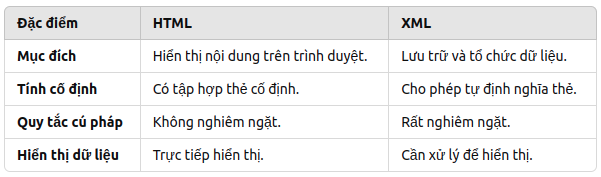

# HTML5

### 1. History

HTML - HyperText Markup Language là ngôn ngữ đánh dấu được sử dụng để tạo các trang web.

- 1990-1995: HTML được phát triển bởi Tim Berners-Lee vào năm 1990 - Tổ chức hạt nhân châu Âu. Dùng để chia sẻ tài liệu qua mạng lưới máy tính. Nó nhanh chóng trở thành ngôn ngữ cơ bản để tạo website.
- 1993: Phiên bản đầu tiên HTML, chỉ hỗ trợ các thẻ cơ bản `<p>`, `<a>`, ``, `<h1>`
- 1995: Được chuẩn hóa bở IETF - Internet Engineering Task Force, hỗ trợ tính năng cơ bản như biểu mẫu (forms) với thẻ `<form>`, `<input>`
- 1996-1999: Sự phát triển của Word Wide Web dẫn đến nhu cầu cải tiến của HTML
- 1997:
  - Được chuẩn hóa bởi W3C (World Wide Web Consortium)
  - Hỗ trợ các bảng `<table>` và kiểu chữ (font) thông qua thẻ `<font>`.
  - Bổ xung các yếu tố truy cập (accessibility) và hỗ trợ nhiều ngôn ngữ
  - Đưa ra khái niệm tách biệt HTML và CSS
- 2000-2008:
- 2000: XHTML ra đời nó là sự kết hợp giữa HTML và XML. XHTML tăng tính tương thích với trình duyệt và mobile nhưng quá phức tạp nên không được đón nhận
- 2014: HTML 5 ra đời.
  - Chính thức được phát hành bởi W3C
  - Hỗ trợ đa phương tiện audio, video mà không cần plugin như Flash
  - Bổ xung các API mạnh mẽ như Canvas, Geolocation, Web Storage

### 2. XML

```javascript
<book>
  <title>Learning XML</title>
  <author>John Doe</author>
  <price>25.99</price>
</book>
```

XML - Extensible Markup Language. Nó là một ngôn ngữ đánh dấu để lưu trữ. Khác với HTML XML tập trung vào lưu trữ dữ liệu không quan tâm đến cách hiển thị như HTML.

- XML có thể truy cập và hiển thị bằng cách sử dụng Javascript hoặc công nghệ khác.
- Trước khi JSON ra đời thì XML từng là định dạng phổ biến để trao đổi giữ liệu giữa máy chủ và trình duyệt
- So sánh HTML vs XML
  

### 3. HTML5 features

#### Semantic Tags - Thẻ ngữ nghĩa

Làm cho mã HTML dễ hiểu hơn đối với trình duyệt, công cụ tìm kiếm và các công cụ hỗ trợ.

- `<header>`: Phần đầu của trang hoặc phần nội dung
- `<nav>`: Khu vực chưa liên kết điều hướng
- `<section>`: Một phần nội dung có ý nghĩa riêng biệt
- `<article>`: Nội dung độc lập, ví dụ bài viết blog
- `<aside>`: Nội dung phụ hoặc chú thích
- `<footer>`: Phần cuối trang haowjc phần nội dung
- `<main>`: Nội dung chính của trang web
- `<mark>`: Đánh dấu nội dung quan trọng hoặc nổi bật
- `<time>`: Thời gian,
- `<figure>`: Hình ảnh với chú thích
- `<figcaption>`: chú thích hình ảnh

#### Media tags - Thẻ đa phương tiện

- `<audio>`: Nhúng âm thanh
- `<video>`: Nhúng video
- `<source>`: Chỉ định nguồn âm thanh hoặc video
- `<track>`: Thêm phụ đề hoặc thông tin liên quan cho video

#### Thẻ Form mới

- `<datalist>`: Cung cấp danh sách gợi ý nhập liệu
- `<keygen>`: Tạo mã hóa (deprecated)
- `<output>`: Hiển thị kết quả của phép tính hoặc xử lý dữ liệu

#### Thuộc tính mới

- placeholder: Văn bản gợi ý trong ô nhập liệu
- required: Bắt buộc phải nhập
- pattern: Định dạng dữ liệu đầu vào bằng biểu thức chính quy
- min/max: Giá trị tối thiểu và tối đa
- step: Bước tăng/giảm (dùng với số/ngày)

#### Thẻ Canvas và SVG

- `<canvas>`: Cung cấp không gian vẽ đồ họa 2D và 3D
- SVG (Scalable Vector Graphics): Dùng để nhúng hình ảnh vector

#### Cải tiến

- `<a>`: Thêm "download" - Tải xuống tệp khi nhấp vào liên kết
- `<input>`: Thêm các loại type dữ liệu mới
  - email
  - url
  - tel
  - date
  - number
  - range
  - color
- `<iframe>`:
  - sanbox: Kiểm soát bảo mật nội dung nhúng
  - srcdoc: Nội dung HTML trực tiếp trong `<iframe>`

#### Thuộc tính toàn cục

Các thuộc tính này có thể được sử dụng trực tiếp trên bất kỳ thẻ nào:

- contenteditable: Cho phép chỉnh sửa nội dung trực tiếp
- draggable: Kích hoạt tính năng kéo thả
- hidden: Ẩn phần tử nhưng vẫn giữ trong DOM
- spellcheck: Kiểm tra chính tả
- data-\*: Thuộc tính tùy chỉnh để lưu trữ dữ liệu

#### Các API mới

HTML5 giới thiệu nhiều API mạnh mẽ hỗ trợ phát triển ứng dụng web tương tác

- Web Storate:
  - LocalStorage: Lưu trữ dữ liệu cục bộ không bị mất khi tải lại trang
  - SessionStorage: Lưu trữ dữ liệu cục bộ trong phiên làm việc hiện tại
- Geolocation API: Cung cấp thông tin vị trí địa lý của người dùng
- Canvas API: Hỗ trợ vẽ đồ họa 2D hoặc 3D trên thẻ `<canvas>`
- Web Workers: Chạy các tác vụ phức tạp trong nền mà không làm ảnh hưởng đến hiệu suất giao diện
- WebSocket API: Kết nối hai chiều, thời gian thực giữa máy khách và máy chủ
- Drag and Drop API: Hỗ trợ kéo thả trực quan giao diện

#### Phần bị loại bỏ

- Thẻ bị loại bỏ: `<font>`,`<center>`, `<big>`,`<acronym>`,`<applet>`
- Thuộc tính bị loại bỏ: align, bgcolor, border, marginwidth
