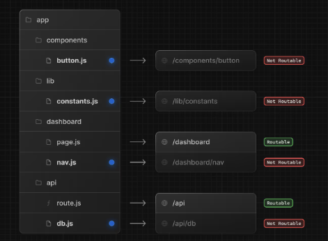

# Next JS

### 1. History

### 2. Routing

#### Colocation

Chỉ có file name là page hoặc route mới được tính là public address.

### 3. Rendering

### 4. Data Fetching

### 5. Styling

### 6. Optimizations

### 7. Typescript
