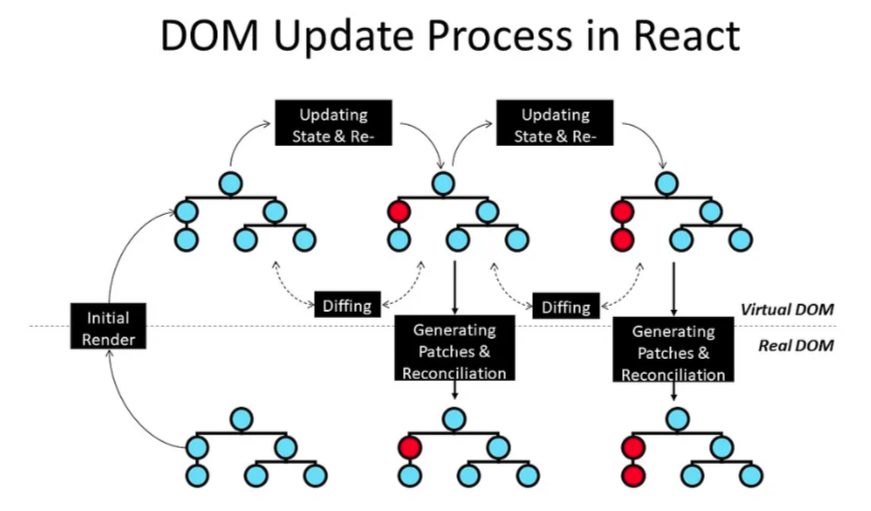

# React

### 1. Lịch sử phát triển React

- 2011:
  Jordan Walke, một kỹ sư tại Facebook, đã phát triển một nguyên mẫu ban đầu của React, được gọi là FaxJS.Giúp xây dựng UI bằng cách sử dụng virtual DOM
- 2012:
  React sử dụng để làm trang News feed của facebook
- 2013:
  Facebook chính thức ra mắt react tại hội nghị Javascript. React trở thành mã nguồn mở trên Github
- 2016:
  React đạt phiên bản 15.0 đạt cải tiến về hiệu năng, API và JSX trở thành một phần quan trọng trong hệ sinh thái React
- 2018:
  React giới thiệu hook trong phiên bản 16.8. Một cuộc cách mạng hóa trong việc viết và quản lý state trong React.
- 2019:
  React Concurrent Mode và suspense được công bố mang lại khả năng tối ưu hóa hiệu năng cho ứng dụng phực tạp. React mở rộng thêm Redux, Next Js và nhiều thư viện liên quan
- 2022:
  React 18 với nhiều cải tiến lớn như Concurrent Rendering, Automatic Batching và các cái tiến về SSR

### 2. Hook vs Class trong React

#### Class

```javascript
class MyComponent extends React.Component {
  constructor(props) {
    super(props);
    this.state = {
      counter: 0,
      userName: "",
      isLoggedIn: false,
    };
  }

  updateCounter = () => {
    this.setState({ counter: this.state.counter + 1 });
  };

  updateUserName = (name) => {
    this.setState({ userName: name }); // Có thể ghi đè các thuộc tính khác nếu không cẩn thận
  };

  toggleLogin = () => {
    this.setState((prevState) => ({ isLoggedIn: !prevState.isLoggedIn }));
  };

  render() {
    return (
      <div>
        <p>Counter: {this.state.counter}</p>
        <p>User: {this.state.userName}</p>
        <p>Logged in: {this.state.isLoggedIn ? "Yes" : "No"}</p>
        <button onClick={this.updateCounter}>Increment Counter</button>
        <button onClick={() => this.updateUserName("Alice")}>Set Name</button>
        <button onClick={this.toggleLogin}>Toggle Login</button>
      </div>
    );
  }
}
```

- Sử dụng cú pháp this.state hoặc setState để cập nhật lại state
- Sử dụng cú pháp this, dễ xảy ra lỗi khi xử lý trong các function
- Sử dụng cú pháp ES6 class
- Quản lý vòng đời qua các phương thức:
  - componentDidMount(): Được gọi sau khi component đã được gắn vào DOM.
  - shouldComponentUpdate(nextProps,nextState): Quyết định xem component có nên render lại hay không. Return true/false.
  - componentDidUpdate(): Được gọi sau khi DOM đã cập nhật. Dùng để thực hiện các tác vụ liên quan đến dữ liệu mới.
  - componentWillUnmount(): Được gọi trước khi component bị gỡ khỏi DOM. Dùng để clean up.

#### So sánh Lifecycle giữa Class và Hook

- Giống nhau:
  Đều xử lý 3 giai đoạn là : mount, update và unmount
- Khác nhau:
  Với Class: Mỗi vòng đời lại có một phương thức riêng tách biệt: + Mounting: constructor, componentDidMount. + Updating: shouldComponentUpdate, componentDidUpdate + Unmounting: componnetWillUnmount.
  => Cần nhớ và sử dụng đúng phương thức cho từng giai đoạn. Khó tái sử dụng và dễ gặp vấn để với logic phức tạp.
  Hook: Xử lý toàn bộ trong 1 hàm useEffect. Quản lý đơn giản qua dependency.

### 3. JSX convert to Javascript

- React sẽ cung cấp React.createElement để tạo nên các React Element - đơn vị nhỏ nhất trong React.
- Babel sẽ giúp chuyển đổi các đoạn mã JSX thành React.createElement. Ví dụ:

```javascript
const element = (
  <div className="container">
    <h1>Title</h1>
    <p>Description</p>
  </div>
);
```

Sẽ được Bable biên dịch thành:

```javascript
const element = React.createElement(
  "div",
  { className: "container" },
  React.createElement("h1", null, "Title"),
  React.createElement("p", null, "Description")
);
```

### 4. Virtual DOM

React Element:

```javascript
const element = React.createElement(
  "div",
  { id: "container" },
  "Hello, World!"
);
```

Virtual DOM:

```javascript
{
  type: 'div',
  props: {
    id: 'container',
    children: 'Hello, World!'
  }
}
```

- React.createElement được sử dụng để tạo ra React Elements và chính React Elements này chính là thành phần cấu tạo của Virtual DOM.
- Virtual DOM là một bản sao của DOM thực tế, được lưu trong bộ nhớ và không trực tiếp gắn với giao điện trình duyệt.
- Các bước update DOM:
  
  - Khi state/props thay đổi React tạo ra một cây Virtual DOM mới.
  - So sánh Virtual DOM cũ và mới bằng cách check sự thay đổi giữa các node trong component tree - <b>Diffing (Tìm sự khác biệt)</b>
  - Tìm ra sự khác biệt - <b>Reconciliation (Hợp nhất)</b>
  - Cập nhật tối thiểu phần thay đổi vào DOM thực

### 5. Code Splitting React.lazy, Suspense, Concurrent Rendering, Auto Batching

#### Code Splitting - React 2019

Dùng để tách ứng dụng thành các phần nhỏ và chỉ tải chúng khi cần thiết thay vì tải toàn bộ từ đầu.
Lợi ích là giúp tăng tốc độ tải trang ban đầu, giảm dung lượng file Javascript phân chia mã nguồn thành các gói nhỏ giúp trình duyệt tải và phân tích nhanh hơn.

- Dynamic Import
  - Sử dụng React.lazy() để làm dynamic import. Nó chỉ tải component khi cpn đó được render lần đầu tiên.
  - Được kết hợp với Suspense để hiển thị fallback UI khi component đang tải (loading).

=> Đối với server side thì nó sẽ build app thành các bundle ứng với các route và khi call route nào thì nó sẽ chỉ trả về bundle của route đó thôi.

#### Concurrent Rendering - React 2022 - React 18

- Concurrent Rendering cho phép React tạm dừng hoặc ngắt quãng quá trình render (render phase) để xử lý tác vụ ưu tiên cao hơn chẳng hạn như phản hồi tương tác người dùng như click, hover, scroll.
- Trong môi trường concurrent việc "hoàn thành render" có thể bị trì hoãn đến khi react quyết định rằng các phần quan trọng đã được xử lý.
- Có 2 giai đoạn render là Render Phase và Commit Phase.
  - Render phase: React chuẩn bị DOM ảo và tính toán các thay đổi cần thiết.Giai đoạn này có thể bị trì hoãn trong Concurrent Rendering
  - Commit Phase: React thực sự cập nhật lên DOM thật và các hook như useEffect hay useLayoutEffect sẽ đưa vào hàng đợi. Commit phase luôn là một quá trình đồng bộ tức là React sẽ quyết định bắt đầu commit nó sẽ chạy đến khi hoàn tất.

#### Auto Batching

Cơ chế auto Batching là react sẽ gom các cập nhật State lại thành 1 nhóm rồi sau đó mới tiến hành cập nhật 1 lượt thay vì mỗi 1 thay đổi là lại cập nhật state. Khi gọi setState bản chất là nó đưa các hàm setState vào trong bộ nhớ đệm queue và sau khi hoàn tất event hoặc các hàm bất đồng bộ thì nó mới chạy toàn bộ queue đó để cập nhật state.
=> Cái này chính là lý do tại sao nếu sử dụng state mới ngay sau khi setState thì ta vẫn nhận được giá trị cũ của state đó.

### 7. Hooks

#### useLayoutEffect

Khác với useEffect là nó sẽ chạy sau khi DOM thực tế và trình duyệt đã toàn tất việc paint. Với useLayoutEffect nó sẽ chạy ngay sau khi DOM thực tế được hoàn tất và trước khi được paint lên trình duyệt vì vậy nó cho phép cập nhật những thay đổi DOM trước khi người dùng có thể nhìn thấy.

#### useCallback

- useCallback - memoize function.
  Mỗi lần khi component được mount vào DOM thì nó sẽ render ra toàn bộ các function cũng như UI. Mỗi khi state thay đổi thì nó sẽ render lại component và khiến các function cũng được khởi tạo lại sau mỗi lần re-render.
- Điểm giống so với function bình thường là useCallback cũng sẽ được render lần đầu tiên tương tự như các function khác nhưng trong lần render tiếp theo nếu như dependency không thay đổi thì hàm useCallback sẽ không cần khởi tạo lại nữa nếu như hàm useCallback chứa các logic phức tạp thì nó sẽ tăng cường hiệu năng nhiều cho component.
- useCallback có thể kết hợp tốt với useEffect vì khi cho useCallback làm dependency thì mỗi khi dependency của useCallback thay đổi thì nó mới khởi tạo lại function và chạy vào useCallback.
- Đối với các hàm đơn gian thì không nhất thiết phải bọc trong useCallback vì nó chỉ là minor improvement
- Lưu ý: Nếu sử dụng useCallback thì cần kiểm tra kỹ xem hàm có phụ thuộc vào biến nào từ state hoặc props không. Nếu có thì bắt buộc phải thêm vào dependency vì nếu không thêm vào dependency thì khi gọi hàm nó sẽ lấy giá trị cũ của biến đó dẫn tới giá trị sai hoặc các lỗi khó phát hiện.
- Chỉ dùng useCallback với dependency là rỗng khi hàm đó không phụ thuộc vào bất cứ biến nào truyền vào.

#### useContext

```javascript
import { createContext, useContext, useEffect, useState } from "react";

const GlobalContext = (createContext < string) | (null > null);

export const useGlobalContext = () => {
  const contextValue = useContext(GlobalContext);

  if (!contextValue) {
    throw new Error(
      "useGlobalContext must be called from within an GlobalProvider"
    );
  }

  return contextValue;
};

export default function GlobalProvider({
  children,
}: {
  children: React.ReactNode,
}) {
  const [value, setValue] = (useState < string) | (null > "");

  useEffect(() => {
    setValue("value context");
  }, []);
  return (
    <GlobalContext.Provider value={value}>{children}</GlobalContext.Provider>
  );
}
```

### 8. Hooks React 18

#### useDebugValue

#### useDeferredValue

#### useId

#### useInsertionEffect

#### useSyncExternalStore

#### useTransition

### 9. Hooks React 19

#### useOptimistic

#### useActionState

#### useFormStatus
