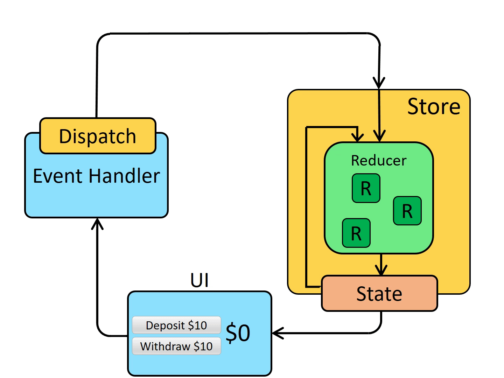

# Redux



- One-way data flow
- Immutable:
  Đối với redux khi update state thì nó sẽ tạo ra 1 bản copy của state cũ và lưu lại vào địa chỉ ô nhớ mới thay vì update trực tiếp state cũ. Đối với redux toolkit thì đã tích hợp sẵn immer để làm điều này.

# Redux Toolkit

#### 1. Store

@/store

```javascript
import { configureStore } from "@reduxjs/toolkit";
import { rootReducers } from "./rootReducer";

export const store = configureStore({
  reducer: rootReducers,
});

export type RootState = ReturnType<typeof store.getState>;
export type AppDispatch = typeof store.dispatch;
```

#### 2. Hooks

@/hooks

```javascript
import { useDispatch, useSelector } from 'react-redux'
import { AppDispatch, RootState } from '../store'

// Use throughout your app instead of plain `useDispatch` and `useSelector`
export const useAppDispatch = useDispatch.withTypes<AppDispatch>()
export const useAppSelector = useSelector.withTypes<RootState>()
```

#### 3. Slices

@/features/counter/counterSlice

```javascript
import { createSlice } from "@reduxjs/toolkit";

interface CounterState {
  value: number;
}

const initialState: CounterState = {
  value: 0,
};

export const counterSlice = createSlice({
  name: "counter",
  initialState,
  reducers: {
    increment: (state) => {
      state.value += 1;
    },
    decrement: (state) => {
      state.value -= 1;
    },
  },
});

export const { increment, decrement } = counterSlice.actions;

export default counterSlice.reducer;
```

#### 4. Rootreducer

@/store/rootReducer.ts

```javascript
import { combineReducers } from "@reduxjs/toolkit";
import counterSlice from "../features/counter/counterSlice";

export const rootReducers = combineReducers({
  counter: counterSlice,
});
```

#### 5. Provider

@/main.ts

```javascript
import { StrictMode } from "react";
import { createRoot } from "react-dom/client";
import "./index.css";
import App from "./App.tsx";
import { store } from "./store";
import { Provider } from "react-redux";

createRoot(document.getElementById("root")!).render(
  <StrictMode>
    <Provider store={store}>
      <App />
    </Provider>
  </StrictMode>
);
```

#### 6. Usage

```javascript
import "./App.css";
import { decrement, increment } from "./features/counter/counterSlice";
import { useAppDispatch, useAppSelector } from "./hooks";

function App() {
  const counter = useAppSelector((state) => state.counter.value);
  const dispatch = useAppDispatch();
  return (
    <>
      Counter: {counter}
      <button onClick={() => dispatch(increment())}>+</button>
      <button onClick={() => dispatch(decrement())}>-</button>
    </>
  );
}

export default App;
```

# Redux Thunk

Redux thunk giúp tách biệt logic xử lý bất đồng bộ, call API và tương tác với store ra khỏi UI. Thuận tiện cho việc test cũng như với dự án lớn phát triển sau này. Nó còn support handle các trạng thái như pending, fulfilled hay rejected dựa vào đó có thể show loading hoặc error nếu cần.

#### Setup slice

- productId: tương ứng với payload truyền vào
- thunkAPI: có thêm các thuộc tính như getState, dispatch, rejectWithValue ,... để tương tác với state
- action.payload: chính là giá trị mà createAsyncThunk trả về
- product/fetchProducts: Tên định danh và là unique. Đây là tên duy nhất dùng để xác định action trong Redux DevTools hoặc khi cần xử lý trong extraReducers.

```javascript
import { createSlice, createAsyncThunk } from "@reduxjs/toolkit";

type Product = {
  id: number;
  title: string;
  price: number;
  image: string;
  category: string;
};

export const fetchProducts = createAsyncThunk<Product[], number>(
  "product/fetchProducts",
  async (productId, thunkAPI) => {
    try {
      console.log({ productId });
      const res = await fetch("https://fakestoreapi.com/products");
      const data = await res.json();
      return data;
    } catch (error) {
      if (error instanceof Error) {
        return thunkAPI.rejectWithValue(error.message);
          } else {
        return "Something went wrong!";
      }
    }
  }
);

const productSlice = createSlice({
  name: "product",
  initialState: {
    data: [] as Product[],
    loading: false,
    error: null as string | null,
  },
  reducers: {}, // Có thể thêm các reducers thông thường nếu cần
  extraReducers: (builder) => {
    builder
      .addCase(fetchProducts.pending, (state) => {
        state.loading = true;
        state.error = null;
      })
      .addCase(fetchProducts.fulfilled, (state, action) => {
        state.loading = false;
        state.data = action.payload;
      })
      .addCase(fetchProducts.rejected, (state, action) => {
        state.loading = false;
        state.error = action.payload as null | string;
      });
  },
});

export default productSlice.reducer;
```

#### Usage

```javascript
import { useEffect } from "react";
import "./App.css";
import { useAppDispatch, useAppSelector } from "./hooks";
import { fetchProducts } from "./features/product/productSlice";

function App() {
  const dispatch = useAppDispatch();
  const { data, loading, error } = useAppSelector((state) => state.product);

  useEffect(() => {
    dispatch(fetchProducts(1));
  }, [dispatch]);

  if (loading) return <p>Loading...</p>;

  if (error) return <p>Error: {error}</p>;

  return (
    <div style={{ display: "flex", flexWrap: "wrap", gap: "12px" }}>
      {data.map((item) => (
        <div
          key={item.id}
          style={{ border: "2px solid #ededed", padding: "24px" }}
        >
          <p style={{ whiteSpace: "wrap", width: "400px" }}>{item.title}</p>
          <p>Price: {item.price}$</p>
          
        </div>
      ))}
    </div>
  );
}
```

# Redux Saga

#### Definition

Saga: là một Generator function dùng để quản lý side effect. Redux-Saga sử dụng các Generator functions của Javascript, cho phép viết code bất đồng bộ trông giống đồng bộ
Các effect thường được sử dụng:

- call: Gọi API hoặc hàm bất đồng bộ
- put: Dispatch action
- takeEvery / takeLatest: Lắng nghe và xử lý action
- all: Chạy song song các Saga

#### Setup

#### 1. Slice

@/feature/comment/commentSlice.ts

```javascript
import { createSlice } from "@reduxjs/toolkit";

const commentSlice = createSlice({
  name: "comment",
  initialState: {
    data: [],
    loading: false,
    error: null,
  },
  reducers: {
    fetchCommentsRequest: (state) => {
      state.loading = true;
    },
    fetchCommentsSuccess: (state, action) => {
      state.loading = false;
      state.data = action.payload;
    },
    fetchCommentsFailure: (state, action) => {
      state.loading = false;
      state.error = action.payload;
    },
  },
});

export const {
  fetchCommentsRequest,
  fetchCommentsSuccess,
  fetchCommentsFailure,
} = commentSlice.actions;
export default commentSlice.reducer;
```

#### 2. Saga

@/features/comment/commentSaga.ts

```javascript
import { call, put, takeEvery } from "redux-saga/effects";
import {
  fetchCommentsFailure,
  fetchCommentsRequest,
  fetchCommentsSuccess,
} from "./commentSlice";

const fetchComments = async () => {
  try {
    const res = await fetch("https://jsonplaceholder.typicode.com/comments");
    const data = res.json();
    return data;
  } catch (error) {
    if (error instanceof Error) {
      return error.message;
    } else {
      return "Something went wrong!";
    }
  }
};

function* handleFetchComments() {
  try {
    const posts = yield call(fetchComments);
    yield put(fetchCommentsSuccess(posts));
  } catch (error) {
    if (error instanceof Error) {
      yield put(fetchCommentsFailure(error.message));
    }
  }
}

export function* watchFetchComments() {
  yield takeEvery(fetchCommentsRequest.type, handleFetchComments);
}
```

#### 3. Root Saga

@/store/rootSaga.ts

```javascript
import { all } from "redux-saga/effects";
import { watchFetchPosts } from "../features/post/postSaga";
import { watchFetchComments } from "../features/comment/commentSaga";

export default function* rootSaga() {
  yield all([watchFetchPosts(), watchFetchComments()]);
}
```

#### 4. Config store

@/store

```javascript
import { configureStore } from "@reduxjs/toolkit";
import { rootReducers } from "./rootReducer";
import createSagaMiddleware from "redux-saga";
import rootSaga from "./rootSaga";

const sagaMiddleware = createSagaMiddleware();

export const store = configureStore({
  reducer: rootReducers,
  middleware: (getDefaultMiddleware) =>
    getDefaultMiddleware().concat(sagaMiddleware),
});

export type RootState = ReturnType<typeof store.getState>;
export type AppDispatch = typeof store.dispatch;

sagaMiddleware.run(rootSaga);
```

#### 5. Usage

```javascript
import { useEffect } from "react";
import "./App.css";
import { fetchCommentsRequest } from "./features/comment/commentSlice";
import { fetchPostRequest } from "./features/post/postSlice";
import { useAppDispatch, useAppSelector } from "./hooks";

function App() {
  const dispatch = useAppDispatch();
  const {
    data: posts,
    loading: loadingPost,
    error: errorPost,
  } = useAppSelector((state) => state.post);
  const {
    data: comments,
    loading: loadingComment,
    error: errorComment,
  } = useAppSelector((state) => state.comment);

  useEffect(() => {
    dispatch(fetchPostRequest());
    dispatch(fetchCommentsRequest());
  }, [dispatch]);

  if (loadingPost || loadingComment) return <p>Loading...</p>;

  if (errorPost) return <p>Error: {errorPost}</p>;

  if (errorComment) return <p>Error: {errorComment}</p>;

  return (
    <div style={{ display: "flex", gap: "24px" }}>
      <div>
        {posts.map((post) => (
          <p key={post.id}>{post.title}</p>
        ))}
      </div>
      <div>
        {comments.map((comment) => (
          <div key={comment.id}>
            <p>Email:{comment.email}</p>
            <p>Name:{comment.name}</p>
          </div>
        ))}
      </div>
    </div>
  );
}

export default App;
```
