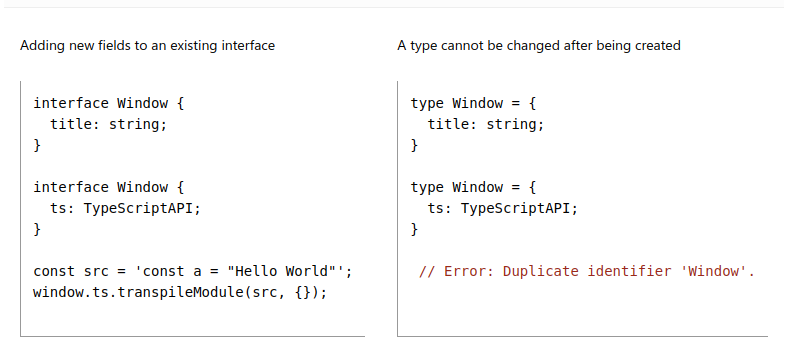
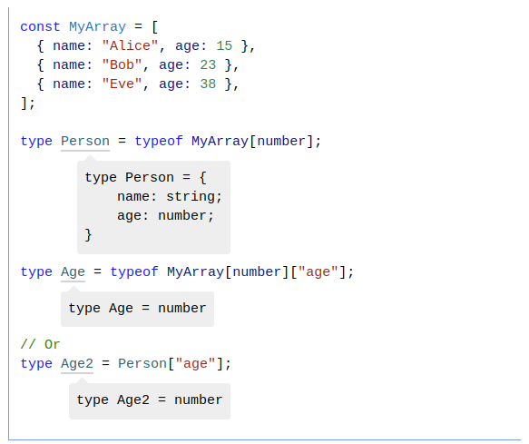

# Typescript

### 1. The Basics

#### Static type-checking

Static types systems định hình type cho các biến. Typescript sẽ sử dụng thông tin này để throw error mỗi khi lỗi.


#### Non-exception Failures

Có những trường hợp hoàn toàn hợp lệ với Javascript nhưng trái lại với Typescript


#### Types for Tooling

Typescript có thể catch bugs trong code nhưng nó cũng có thể ngăn chặn bugs ngay khi code. Nó cung cấp các thông tin về các properties có thể access. Khi khai báo type đầy đủ thì nó sẽ suggest các properties mà mình có thể sử dụng.


Một editor nữa support typescript là "quick fixes" nó giúp nhanh chóng sửa các lỗi liên quan đến typescript

#### Strictness

Nếu không cấu hình file tsconfig.json hoặc không thiết lập cụ thể như strict hoặc noImplicitAny thì nó sẽ set mặc định là false và bỏ qua check các phần này.


```javascript
"compilerOptions": {
    "strict": true,
    "noImplicitAny": false,
  },
```

Nếu config là "strict": true thì mặc định sẽ turn on toàn bộ. Nhưng cũng có thể config từng cái riêng lẻ. Trong đó có 2 thứ rất quan trọng như noImplicitAny và strictNullChecks.

- noImplicitAny: yêu cầu định nghĩa rõ kiểu hoặc để Typescript suy luận kiểu, thay vì để kiểu là any một cách ngầm định

```javascript
// Khi `noImplicitAny` là true
function add(a, b) {
  return a + b; // Lỗi: Tham số 'a' và 'b' có kiểu ngầm định là 'any'.
}

function multiply(a: number, b: number) {
  return a * b; // Không lỗi vì kiểu đã được định rõ.
}
```

- strictNullChecks: buộc phải xử lý các giá trị null hoặc undefined

```javascript
let name: string = null; // Lỗi: 'null' không thể gán cho kiểu 'string'.

let maybeName: string | null = null; // Được phép vì kiểu bao gồm 'null'.

function printName(name: string | null) {
  if (name) {
    console.log(name.toUpperCase()); // OK: Đã kiểm tra `null`.
  } else {
    console.log("No name provided");
  }
}
```

### 2. Everyday Types

#### Contextual typing


Mặc dù "s" chưa được định nghĩa type nhưng Typescript dựa vào types của forEach function inferred type (suy ra type) của array để để định nghĩa ra type của "s". Process này gọi là contextual typing.

#### Union Types

Union type là sự kết hợp của hai hoặc nhiều types lại với nhau.


Khi làm việc với union type thì sẽ có thể bị lỗi như sau:

Nếu sử dụng các properties thì cái đó phải tồn tại trong toàn bộ các type. Nếu không thì cần sử lý với phương pháp "Narrow" - tách nhỏ các case.


#### Type Aliases

Type Alias trong Typescript là một cách để định nghĩa một tên mới (alias) cho một kiểu dữ liệu giúp dễ quản lý và tái sử dụng hơn. Nó được tạo bằng từ khóa type.


#### Interface


Nó tương đồng với Type aliases. Trong một số trường hợp có thể chọn sử dụng type và interface một cách tùy ý. Hầu hết các features của interface thì đều có trong type. Cả hai đều có thể extendable. Điểm khác biệt quan trọng nhất giữa type và interface là:

- Type thì không thể add thêm new properties
- Interface thì có thể
  
  

#### Type Assertions

Khi mà bạn biết thông tin kiểu dữ liệu và biết chắc chắn nó luôn là kiểu dữ liệu đó thì bạn có thể sử dụng type assertions.

Typescript sẽ chặn việc ép kiểu không khả thi ví dụ:


#### Literal Types

với var và let thì có thể change value nhưng với const thì ngược lại. Literal types sẽ cụ thể hóa các giá trị có thể có của type. Nó thường được kết hợp với unions.


#### Literal Inerence


Có 2 cách để xử lý vấn đề trên

- Sử dụng ép kiểu bằng cách thêm type assertion vào từng vị trí tương ứng:
  
- Sử dụng "as const" để convert toàn bộ object sang sử dụng kiểu type literals
  

#### Non-null Assertion Operator (Postfix !)

Chỉ sử dụng khi biết chắc value không thể null hoặc undefined


### 3. Narrowing

#### Typeof

typeof operator sẽ cho thông tin type cơ bản của một giá trị tại thời điểm runtime.

Nhưng nó không tồn tại typeof là "null" nên sẽ phải handle null riêng không phải bằng cách check typeof


#### Type never

Never type biểu thị một giá trị không bao giờ xảy ra hoặc một biến được xác định là không bao giờ có giá trị hợp lệ

```typescript
type Animal = "cat" | "dog";
function checkAnimal(animal: Animal): string {
  switch (animal) {
    case "cat":
      return "Meow";
    case "dog":
      return "Woof";
    default:
      const _exhaustive: never = animal; // Giúp kiểm tra loại giá trị bất hợp lệ
      throw new Error(`Unexpected animal: ${animal}`);
  }
}
```

Dùng never khi muốn chỉ định rằng một hàm không bao giờ trả về hoặc đảm bảo rằng đoạn mã không thể xảy ra được xử lý một cách an toàn.

#### Một số khái niệm khác

- Truthiness narrowing
  
- Equality narrowing
  
- Instanceof narrowing
  
- Exhaustiveness checking
  

#### Extending Types

Interface và Type có thể extend multiple types


### 4. Creating Types from Types

- Generics: Types nhận paramters
- Keyof Type Operator: Sử dụng "keyof" operator để tạo type mới
- Typeof Type Operator: Sử dụng "typeof" operator để tạo type mới
- Indexed Access Types: Sử dụng "Type['a']" syntax để truy cập các type của phần tử con
- Conditional Types: Hoạt động giống như if else statements
- Mapped Types: Tạo type bằng cách mapping các thuộc tính với type tương ứng
- Template Literal Types: Mapped các type với template literal strings

#### Generics

- Sử dụng generic type khi không biết trước kiểu dữ liệu truyền vào.
- Sử dụng generic type trong trường hợp muốn viết một hàm tổng quát thích hợp với nhiều kiểu dữ liệu khác nhau được truyền vào.
- Đảm bảo an toàn cho kiểu dữ liệu (type safety). Ví dụ truyền vào là string thì chắc chắn reponse trả về sẽ là string.
- Không sử dụng generic khi kiểu dữ liệu đầu vào và đầu ra khác nhau

```
function identity<T>(value: T): T {
    return value;
}
```

- T là viết tắt của Type, có thể thay T bằng bất cứ ký tự nào miễn là dễ đọc dễ hiểu.
- `<T>`: Cần thêm ngay sau function để khai báo rằng T là một kiểu dữ liệu tổng quát. Nếu không khai báo `<T>` thì nó sẽ báo lỗi vì không biết T là type gì.

#### Keyof type operator


Với 2 ví dụ trên thì keyof có thể nhận key của object là type khi được sử dụng để tạo 1 type mới. Vd 1: nếu x và y chưa được khai báo type thì type P sẽ có dạng Literal Types tương ứng là "x" | "y". Vd 2: Nếu key đã được khai báo type thì nó sẽ lấy type của key làm type mới.

- Nếu set type bằng number thì mặc định nó chỉ có thể là number thôi
- Nếu set type là string thì nó mặc định sẽ có 2 type là number và string bời vì number có thể convert sang string mà không có chiều ngược lại. Vd: 3 => "3". "string" => NaN.

#### Typeof

- Sử dụng typeof sẽ hợp lý khi kết hợp với ReturnType.
  
- Lưu ý rằng value khác với type nên ta sẽ không thể ghi returnType trực tiếp một funtion được
  
- Fix lỗi trên bằng cách sử dụng typeof
  
- Hạn chế của việc sử dụng typeof là không thể ghi trực tiếp typeof function vì javascript sẽ chặn điều này để tránh việc nhầm lẫn với việc call function.
  

#### Indexed Access Types

- Có thể sử dụng indexed để access type
  
- Có thể kết hợp giữa union, keyof hoặc type để access type.
  
- Nếu sử dụng sai index thì nó sẽ báo lỗi
  
- Kết hợp giữa typeof và key
  
- Không thể sử dụng const để tạo biến thay thế key thay vào đó nếu cần hãy sử dụng type
  
  

#### Conditional Types

Conditional type sẽ check xem việc extends có đúng hay k và trả về type tương ứng.
Ví dụ đơn giản:

```typescript
type IsString<T> = T extends string ? "yes" : "no";

type Result1 = IsString<string>; // "yes"
type Result2 = IsString<number>; // "no"
```

Ví dụ thực tế:

```typescript
type ElementType<T> = T extends Array<infer U> ? U : T;

type A = ElementType<string[]>; // string
type B = ElementType<number[]>; // number
type C = ElementType<boolean>; // boolean
```

#### Mapped Types

```typescript
type MappedType = {
  [Key in UnionType]: ValueType;
};
```

Dùng để biến đổi hoặc ánh xạ (map) một kiểu hiện có thành một kiểu mới.
VD ánh xạ cơ bản:

```typescript
type User = {
  id: number;
  name: string;
  isAdmin: boolean;
};

type ReadonlyUser = {
  [Key in keyof User]: Readonly<User[Key]>;
};

// Kết quả: tất cả các thuộc tính trong ReadonlyUser đều là readonly
type ReadonlyUser = {
  readonly id: number;
  readonly name: string;
  readonly isAdmin: boolean;
};
```

VD 2 tái sử dụng với Generic:

```typescript
type Readonly<T> = {
  [Key in keyof T]: Readonly<T[Key]>;
};

type User = {
  id: number;
  name: string;
  isAdmin: boolean;
};

type ReadonlyUser = Readonly<User>; // Áp dụng mapped type
```

#### Template literal types

- Enum

```javascript
enum Status {
  Active = "active",
  Inactive = "inactive",
  Suspended = "suspended",
}

// Chuyển `enum` thành kiểu
type StatusType = `${Status}`;
// Kết quả
type StatusType = "active" | "inactive" | "suspended";
```

Trong typescript với template literal types cho phép bạn lấy giá trị của một kiểu và biến chúng thành một union type. Chỉ tồn tại từ typescript 4.1 trở lên. Ở các phiên bản thấp hơn thì sẽ sử dụng typeof kết hợp với keyof.

```javascript
type StatusType = typeof Status[keyof typeof Status]
```
